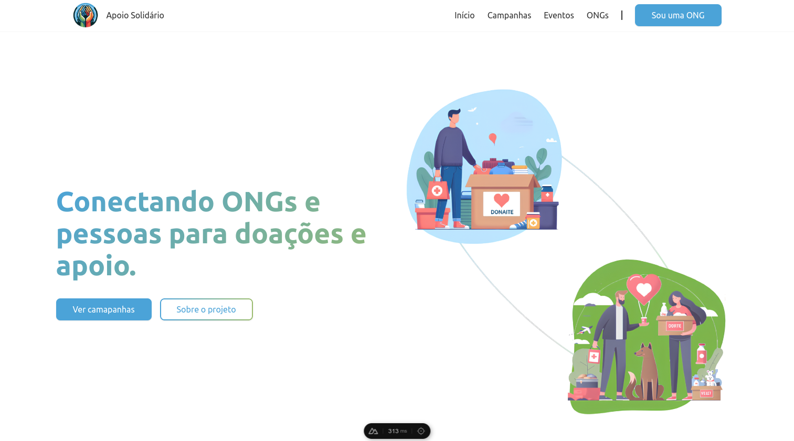

<h1 align="center">
  <br>
  
  <br>
    Apoio Solidário
  <br>
</h1>

<h4 align="center">Esse projeto é uma aplicação desenvolvida com <code>VueJs (NuxtJs)</code> projetada para conectar instituições sem fins lucrativos (ONGs) a potenciais doadores.</h4>



## Tecnologias

- [Nuxt 3](https://nuxt.com/) / [Vue 3](https://vuejs.org/)
- [TypeScript](https://www.typescriptlang.org/)
- [Apoio Solidário (API)](https://github.com/apoio-solidario/apoio-solidario-back-end)
- [Element Plus (UI)](https://element-plus.org/)

## Funcionalidades

### Usuário

- Início: Página mostrando informações sobre o projeto;
- Campanhas: Página listando todas as campanhas ativas no momento;
  - Perfil: Página com detalhes sobre campanha específica;
- Eventos: Página listando todos os eventos ativos no momento;
  - Perfil: Página com detalhes sobre evento específico;
- ONGs: Página mostrando todas as ONGs cadastradas;
  - Perfil: Página com detalhes sobre ONG específica;

### ONG

- Sou uma ONG: Página para as ONG entrarem em contato e/ou acessarem o painel.
- Painel (ONG): Página destinada a ONGs para fazer a criação/remoção/alteração de camapanhas e eventos;

### Admin

- Login: Página para os administradores acessarem o painel.
- Painel (Admin): Página destinada controle de todas as infomações do projeto;

## Como executar o projeto

Passo a passo para fazer o projeto funcionar localmente:

<!-- > !NOTE
> O **front-end** precisa que o **back-end** esteja sendo executado para funcionar. -->

### Requisitos

- Instale o [Git](https://git-scm.com/downloads);
- Instale o [NodeJs v18](https://nodejs.org/pt/download/package-manager) ou maior;
- Instale o [VSCode](https://code.visualstudio.com/).
- Instale a extensão [Nuxtr](https://marketplace.visualstudio.com/items?itemName=Nuxtr.nuxtr-vscode) no VSCode.

Após esses passos, abra o terminal e escolha um local para copiar o projeto.

### Clonagem

Use o seguinte comando para fazer uma cópia do projeto:

```bash
# HTTPS
git clone https://github.com/apoio-solidario/front-end

# SSH
git clone git@github.com:apoio-solidario/front-end.git
```

Depois entre na pasta do projeto com:

```bash
cd ./front-end
```

### Preparação

#### Variáveis

Para o front-end funcionar corretamente vamos precisar de dados (campanhas, eventos, ongs, etc..)

Podemos conseguir os dados através de:

- URL da [API do Apoio Solidário](https://github.com/apoio-solidario/apoio-solidario-back-end)
- URL com dados falsos

Crie um arquivo `.env` seguindo o modelo [.env.example](./.env.example) e após isso, coloque as informações.

Exemplo:

```
AS_API=<url-dos-dados>
```

#### Dependências

Certifique-se de instalar as dependências:

```bash
npm install
```

### Desenvolvimento

Inicie o servidor de desenvolvimento em `http://localhost:4223`:

```bash
npm run dev
```

Agora, abra o link no seu navegador.

## Contribuidores

<table>
  <tr>
    <td align="center">
      <a href="https://github.com/LucJosin" title="Open Github">
        
        <br />
        <sub><b>Lucas Josino</b></sub>
      </a>
    </td>
    <td align="center">
      <a href="https://github.com/JonatasGomesss" title="Open Github">
        
        <br />
        <sub><b>Jonatas</b></sub>
      </a>
    </td>
  </tr>
</table>
